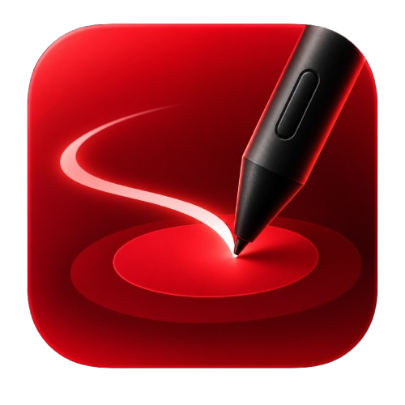

# WacomMapper



**WacomMapper turns a Wacom One by Wacom CTL-472 USB tablet into a mapped Android stylus.** It reads the tablet's USB HID reports, maps its pen coordinates to the Android display, and forwards stylus events system-wide through Shizuku. It is a Kotlin and Jetpack Compose Android app, physically validated with a Samsung Galaxy Tab S7 in landscape orientation.

> WacomMapper is an independent community project and is not affiliated with or endorsed by Wacom or Samsung.

## Features

- Reads the **Wacom CTL-472** through Android USB Host (USB OTG).
- Parses pen position and pressure and maps the tablet's full active area to the current logical display.
- Sends global stylus events through **Shizuku** and Android's input service, including hover, contact, pressure, and supported stylus buttons.
- Runs the active tablet session in a foreground service so it can continue while another app is in the foreground.
- Shows an optional, non-interactive hover cursor overlay with configurable size and color.
- Includes USB/HID, parser, mapping, and output diagnostics for development and troubleshooting.

## Compatibility

| Component | Support |
| --- | --- |
| Tablet | Wacom One by Wacom CTL-472 (VID `0x056A`, PID `0x037A`) |
| Android | Android 8.0 (API 26) or newer; device must support USB Host/OTG |
| Tested device and orientation | Samsung Galaxy Tab S7, landscape, tablet rotation `0°`, full-tablet mapping |
| Global output | Shizuku-backed Android input injection; Shizuku must be running and authorized |

Other Wacom models, portrait mapping, and other Android devices are **not claimed as validated**. WacomMapper does not require root, but global input injection does require a correctly running Shizuku service and its permission. The hover overlay also needs Android's “Display over other apps” permission; without it, stylus injection can still be used without the overlay.

## Requirements

For normal use:

1. An Android device with USB Host/OTG support.
2. A Wacom CTL-472 connected to the device.
3. Shizuku installed, started, and granted to WacomMapper.
4. “Display over other apps” permission if the hover cursor is desired.

For building from source, install Android Studio with the Android SDK required by this project and a compatible JDK. The project uses the Gradle wrapper; do not replace its configured Gradle version arbitrarily.

## Build and test

From the repository root on Windows:

```powershell
.\gradlew.bat testDebugUnitTest
.\gradlew.bat assembleDebug
```

On macOS or Linux:

```sh
./gradlew testDebugUnitTest
./gradlew assembleDebug
```

The debug APK is generated at:

```text
app/build/outputs/apk/debug/app-debug.apk
```

The APK is a local build artifact and is not committed to the source tree. A downloadable **debug pre-release APK** is available on the [Releases page](https://github.com/sebastianabanto/WacomMapper/releases). It is intended for testing, not as a Play Store/production-signed build. Debug APKs from different machines may have different signing keys and may not install as updates over one another.

## Download and install

1. Download the APK asset from [GitHub Releases](https://github.com/sebastianabanto/WacomMapper/releases).
2. Open the downloaded APK on Android and approve the install prompt. If asked, allow the app used to download/open the APK to install unknown apps.
3. Install and start Shizuku as described below.
4. Connect the CTL-472 through a USB-C OTG adapter and grant WacomMapper USB access when Android asks.
5. In Shizuku, authorize WacomMapper. Confirm Shizuku is ready in WacomMapper.
6. Optionally grant **Display over other apps** to enable the hover cursor.
7. Open WacomMapper and tap **Start stylus**. Injection never starts automatically when the app launches. Use **Stop stylus** or the persistent notification action to stop and release input.

### Install and start Shizuku (non-root)

Install Shizuku only from its [official download page](https://shizuku.rikka.app/download/) or an official store listing linked there. On Android 11 or newer, Shizuku can be started on-device using Wireless debugging; a computer is not required for the normal start procedure. Android requires the service to be started again after a reboot. Menu labels can differ by Android/One UI version.

On a Samsung tablet:

1. Open **Settings → About tablet → Software information** and tap **Build number** seven times. Confirm the screen lock if prompted; this enables Developer options.
2. Open **Settings → Developer options → Wireless debugging** and turn it on.
3. Open Shizuku and choose its **Pairing** flow. In Wireless debugging, choose **Pair device with pairing code**; enter the displayed code in the Shizuku notification.
4. Return to Shizuku and tap **Start**. Confirm the service is running.
5. In Shizuku's app-management/authorized-apps screen, allow **WacomMapper**. Return to WacomMapper and verify Shizuku is ready.

Pairing is normally a one-time setup, but Shizuku's non-root service must be started again after a reboot. If it stops, reopen Shizuku and start it again. For Android 10 or older, non-root startup requires a computer and ADB. See the [official Shizuku setup guide](https://shizuku.rikka.app/guide/setup/) for current steps and troubleshooting.

Shizuku gives authorized apps access to privileged system APIs through its service. Only authorize apps you trust. WacomMapper uses this to inject stylus events; it does not require root.

## How it works

```text
CTL-472 USB HID
      ↓
Android USB Host reader
      ↓
CTL-472 report parser
      ↓
Stylus state mapper (hover/contact/buttons/pressure)
      ↓
Coordinate mapper (tablet area → logical display)
      ├── Internal diagnostics canvas
      └── Shizuku input backend → Android apps
```

The USB report parser, stylus-state logic, coordinate mapping, and output backend are separate layers. The global backend uses Shizuku; this project does not implement a root daemon, kernel driver, `uinput` device, or `AccessibilityService`.

## Known limitations

- The validated geometry target is landscape on a Galaxy Tab S7 with full-tablet mapping and tablet rotation `0°`; portrait behavior is not a project requirement and is not validated.
- Android System UI may draw above application overlay windows, so the optional hover cursor may not be visible on every system surface.
- Compatibility with drawing apps can depend on how each app handles injected stylus events. The main validated hardware target is the CTL-472.
- This is an independent project, not an official Wacom driver. It does not claim support for every Wacom tablet or Android device.

## FAQ

### Does WacomMapper need root?

No. Global stylus output uses Shizuku. On a non-rooted device, Shizuku is started through Android's Wireless debugging/ADB service.

### Why does Shizuku show as stopped after restarting the tablet?

That is expected with Shizuku's non-root Wireless debugging startup. Open Shizuku and start the service again after reboot, then return to WacomMapper.

### WacomMapper does not detect my tablet. What should I check?

Confirm it is a CTL-472, use a USB-C adapter that supports USB OTG/Host, reconnect the cable, and accept Android's USB permission prompt. Other Wacom models are not supported by this release.

### Shizuku is running, but global input is not active.

Check that WacomMapper is authorized in Shizuku, then refresh/reopen WacomMapper and verify its Shizuku status is **Ready**. Also confirm the tablet is connected and USB permission was granted. After restoring either service, stop and start the stylus again.

### Why is the hover cursor missing in some places?

The cursor is an optional Android overlay and needs **Display over other apps** permission. Android System UI can appear above app overlays, so the cursor may not be visible on every system surface even while hover input continues to work.

### Is portrait orientation supported?

Portrait mapping is not validated. The recommended and physically validated setup is a Galaxy Tab S7 in landscape, full-tablet mapping, and tablet rotation `0°`.

### Can I install a newer debug APK over this one?

Only if both APKs use the same signing key. Debug keys are machine-specific, so an APK built elsewhere may be rejected as an update. Uninstalling first can resolve a signature conflict, but Android may erase the app's saved settings.

### Is the Release APK production-signed?

No. The attached asset is a debug build for testing. It is not a Play Store release and should not be treated as a production-signed distribution.

## Privacy and repository hygiene

Experimental captures, local Android SDK configuration, build outputs, ADB state, and signing material are excluded from version control. Do not commit USB capture logs or machine-specific files unless they have been reviewed and sanitized.

## License

This project is licensed under the [MIT License](LICENSE).

## Search terms

WacomMapper, Wacom CTL-472 Android, One by Wacom Android tablet, Android USB HID stylus, global stylus input Android, Shizuku stylus, pressure-sensitive pen Android, Samsung Galaxy Tab S7 drawing tablet, Kotlin Android tablet mapping.

---

## Descripción en español

WacomMapper conecta una **Wacom One by Wacom CTL-472** a Android y transforma sus reportes USB HID en entrada global de lápiz, con coordenadas mapeadas, presión, hover y botones compatibles. Está desarrollada en Kotlin con Jetpack Compose y utiliza Shizuku para enviar eventos de stylus a otras aplicaciones sin root. La configuración validada es una Samsung Galaxy Tab S7 en horizontal, con rotación de tableta `0°` y mapeo de toda la superficie.

Para utilizarla se necesita USB Host/OTG, una CTL-472 conectada y Shizuku iniciado y autorizado. El cursor visual de hover es opcional y requiere permiso de **Mostrar sobre otras apps**. En Android 11 o posterior, Shizuku puede iniciarse mediante **Depuración inalámbrica** sin computadora; hay que volver a iniciarlo tras reiniciar la tablet. Consulta [Descargar e instalar](#download-and-install) y las preguntas frecuentes para ver los pasos. El APK de Releases es una compilación debug para pruebas, no una versión firmada para Play Store. El código está bajo licencia MIT.
